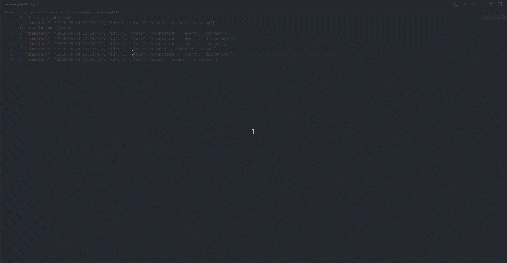

# json-logs

This extention will help you to prettify and manage json logs

[![CodeFactor][codefactor-badge]][codefactor-url]
[![SonarCloud][sonarcloud-badge]][sonarcloud-url]
[![Codacy][codacy-badge]][codacy-url]
[![Total alerts][lgtm-alerts-badge]][lgtm-alerts-url]
[![Language grade][lgtm-lg-badge]][lgtm-lg-url]
[![Scrutinizer][scrutinizer-badge]][scrutinizer-url]

[![Build Status][tests-badge]][tests-url]
[![Commit activity][commit-activity-badge]][github]
[![FOSSA][fossa-badge]][fossa-url]
[![License][badge-lic]][github]

## Table of Contents
  - [Usage](#usage)
  - [Contribute](#contribute)

## Usage

## Contribute

Make the changes to the code and tests. Then commit to your branch. Be sure to follow the commit message conventions. Read [Contributing Guidelines](.github/CONTRIBUTING.md) for details.

[github]: https://github.com/pustovitDmytro/json-logs
[coveralls]: https://coveralls.io/github/pustovitDmytro/json-logs?branch=master
[badge-deps]: https://img.shields.io/david/pustovitDmytro/json-logs.svg
[badge-lic]: https://img.shields.io/github/license/pustovitDmytro/json-logs.svg
[badge-coverage]: https://coveralls.io/repos/github/pustovitDmytro/json-logs/badge.svg?branch=master
[url-coverage]: https://coveralls.io/github/pustovitDmytro/json-logs?branch=master

[tests-badge]: https://img.shields.io/circleci/build/github/pustovitDmytro/json-logs
[tests-url]: https://app.circleci.com/pipelines/github/pustovitDmytro/json-logs

[codefactor-badge]: https://www.codefactor.io/repository/github/pustovitdmytro/json-logs/badge
[codefactor-url]: https://www.codefactor.io/repository/github/pustovitdmytro/json-logs

[commit-activity-badge]: https://img.shields.io/github/commit-activity/m/pustovitDmytro/json-logs

[scrutinizer-badge]: https://scrutinizer-ci.com/g/pustovitDmytro/json-logs/badges/quality-score.png?b=master
[scrutinizer-url]: https://scrutinizer-ci.com/g/pustovitDmytro/json-logs/?branch=master

[lgtm-lg-badge]: https://img.shields.io/lgtm/grade/javascript/g/pustovitDmytro/json-logs.svg?logo=lgtm&logoWidth=18
[lgtm-lg-url]: https://lgtm.com/projects/g/pustovitDmytro/json-logs/context:javascript

[lgtm-alerts-badge]: https://img.shields.io/lgtm/alerts/g/pustovitDmytro/json-logs.svg?logo=lgtm&logoWidth=18
[lgtm-alerts-url]: https://lgtm.com/projects/g/pustovitDmytro/json-logs/alerts/

[codacy-badge]: https://app.codacy.com/project/badge/Grade/8667aa23afaa4725854f098c4b5e8890
[codacy-url]: https://www.codacy.com/gh/pustovitDmytro/json-logs/dashboard?utm_source=github.com&amp;utm_medium=referral&amp;utm_content=pustovitDmytro/json-logs&amp;utm_campaign=Badge_Grade

[sonarcloud-badge]: https://sonarcloud.io/api/project_badges/measure?project=pustovitDmytro_json-logs&metric=alert_status
[sonarcloud-url]: https://sonarcloud.io/dashboard?id=pustovitDmytro_json-logs

[node-ver-test-badge]: https://github.com/pustovitDmytro/json-logs/actions/workflows/npt.yml/badge.svg?branch=master
[node-ver-test-url]: https://github.com/pustovitDmytro/json-logs/actions?query=workflow%3A%22Node.js+versions%22

[fossa-badge]: https://app.fossa.io/api/projects/custom%2B24828%2Fjson-logs.svg?type=shield
[fossa-url]: https://app.fossa.io/projects/custom%2B24828%2Fjson-logs?ref=badge_shield
